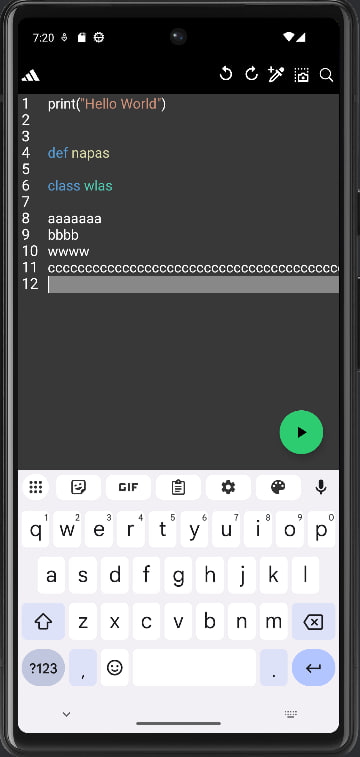

# ScriptFlow

ScriptFlow - Android IDE для редактирования и запуска Python-скриптов прямо на устройстве.

  
  
  
  
  

  

## Текущее состояние

Сейчас проект уже выполняет Python-код через Chaquopy и выводит результат во встроенную консоль. В приложении есть редактор на `CodeView` с базовой подсветкой Python, работа с файлами через SAF (`OpenDocument` и `CreateDocument`), запуск и остановка скрипта через FAB-кнопку и разделение логики по контроллерам в пакетах `editor`, `runtime` и `ui`.

## Ограничения текущей версии

В текущей версии остановка выполнения через `RunController.stop()` не гарантирует завершение Python-кода, особенно для долгих или бесконечных сценариев. Вывод пока буферизуется и появляется после завершения `exec`, а не в режиме построчного live output. Интерактивный ввод через `input()` не поддерживается, сохранение работает в режиме "Save As" через `CreateDocument`, а кнопки `Undo`, `Redo`, `Search`, `Screenshot` и `Eyedropper` пока подключены как заглушки.

## Технологии

Проект написан на Kotlin с AndroidX и Material Components. Для редактора используется `io.github.amrdeveloper:codeview:1.3.9`, для выполнения Python - Chaquopy (`com.chaquo.python:17.0.0`) с Python `3.14`, а для файловых операций применяется Storage Access Framework.

## Требования

Для разработки нужна актуальная Android Studio и JDK 17+, так как проект собирается на AGP 9.x и Gradle 9.x. Для запуска требуется устройство или эмулятор Android 13 и выше, поскольку в приложении выставлены `minSdk = 33`, `compileSdk = 36` и `targetSdk = 36`.

## Структура проекта

Точка входа находится в `app/src/main/java/com/wlaxid/scriptflow/MainActivity.kt`. Логика редактора вынесена в `app/src/main/java/com/wlaxid/scriptflow/editor`, управление выполнением Python - в `app/src/main/java/com/wlaxid/scriptflow/runtime`, а UI-компоненты для тулбара и консоли расположены в `app/src/main/java/com/wlaxid/scriptflow/ui`.

